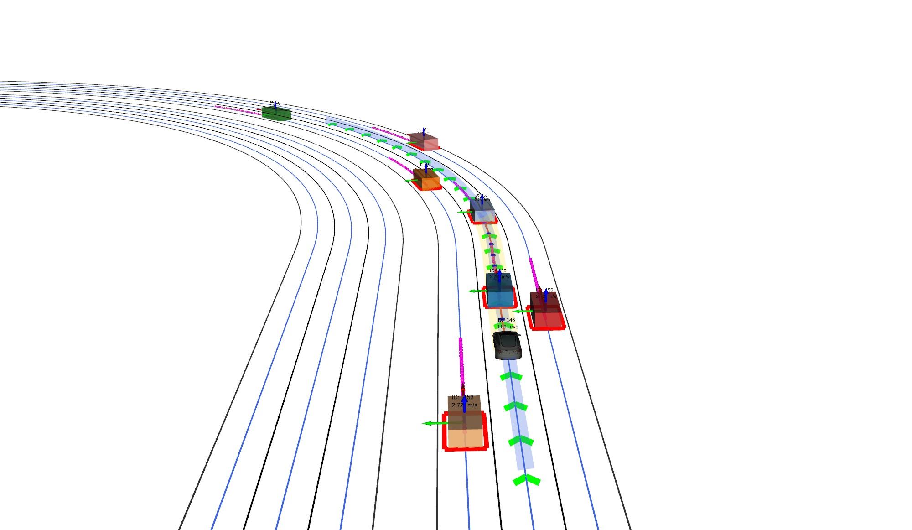
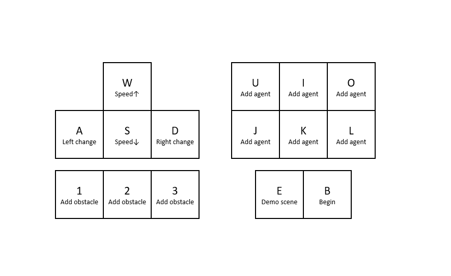

# GPIR

This is the project page of the paper "Real-Time Trajectory Planning for Autonomous Driving with Gaussian Process and Incremental Refinement", to appear in ICRA 2022. 
GPIR is developed aiming to provide an unified real-time trajectory planning framework in dynamic environment for autonomous driving. 

## About

*Paper*: [ArXiv](https://arxiv.org/abs/2205.11853)

*Demo video*: [YouTube](https://youtu.be/PFfj7PzZ3PU)

*Author*: Jie Cheng, Yingbing Chen, Qingwen Zhang, Lu Gan and Ming Liu, [RAM-LAB](https://ram-lab.com/)

If you find this repo helpful for your research, please cite our related paper.

```bibtex
@inproceedings{Jie2022gpir,
  title        = {Real-Time Trajectory Planning for Autonomous Driving with {G}aussian Process and Incremental Refinement},
  author       = {Cheng, Jie and Chen, Yingbing and Zhang, Qingwen and Gan, Lu and Liu, Chengju and Liu, Ming},
  booktitle    = {2022 IEEE International Conference on Robotics and Automation (ICRA)},
  year         = {2022},
  organization = {IEEE}
}
```

## Prerequisites

Our software is developed and tested in Ubuntu20.04 with ROS noetic. Follow [this link](http://wiki.ros.org/noetic/Installation/Ubuntu) to install noetic.

### Simulation environment

We use **Carla-0.9.11** as the simulator (download via this [link](https://github.com/carla-simulator/carla/releases/tag/0.9.11)), and recommend to use a conda environment.

```
conda create -n carla_py37 python=3.7
```

To use the Carla PythonAPI, you need to export the path or install it

```
export PYTHONPATH=$PYTHONPATH:/carla_directory/PythonAPI/carla/dist/carla-0.9.11-py3.7-linux-x86_64.egg
```
or 
```
pip install /carla_directory/PythonAPI/carla/dist/carla-0.9.11-py3.7-linux-x86_64.egg
```

Note that ROS melodic or below use Python2, and you may need to change python version above accordingly.

## Build

### Clone the repository

```
cd ${YOUR_WORKSPACE}/src
git clone --recurse-submodules https://github.com/jchengai/gpir.git

```

### Setup dependencies

```
cd gpir 
conda activate carla_py37
pip install -r ./requirements.txt
bash ./setup.sh
```

You may check the pip path via `which pip`.

### Build gpir

```
cd ../../ 
catkin_make -DCMAKE_BUILD_TYPE=RELEASE -j4
source ./devel/setup.sh
```

## Run a demo

### Start carla-0.9.11 

```
cd to_your_carla_folder && ./carla.sh
```
    
### Start carla ros bridge 
    
```
roslaunch planning_core carla_setup.launch
```

### Start gp_planner 

```
roslaunch planning_core planning.launch
```

<p align="center">
    
</p>

### Start the control console 

Since this repo does not contain the behavior planner, we provide a simple interface for manually controlling the behavior of the Ego vehicle. 

```
roslaunch planning_core keyboard.launch
```

<p align="center">
    
</p>

## Acknowledgements

We would like to express sincere thanks to the authors of the following tools and packages:

- Opendrive map parser: [ad_map](https://github.com/carla-simulator/map)
- QP solver: [osqp](https://github.com/osqp/osqp)
- iSAM solver: [GTSAM](https://github.com/borglab/gtsam)

## License

The source code is released under [MIT](https://opensource.org/licenses/MIT) license.

## Disclaimer

This is research code, it is distributed in the hope that it will be useful, but WITHOUT ANY WARRANTY; without even the implied warranty of merchantability or fitness for a particular purpose.